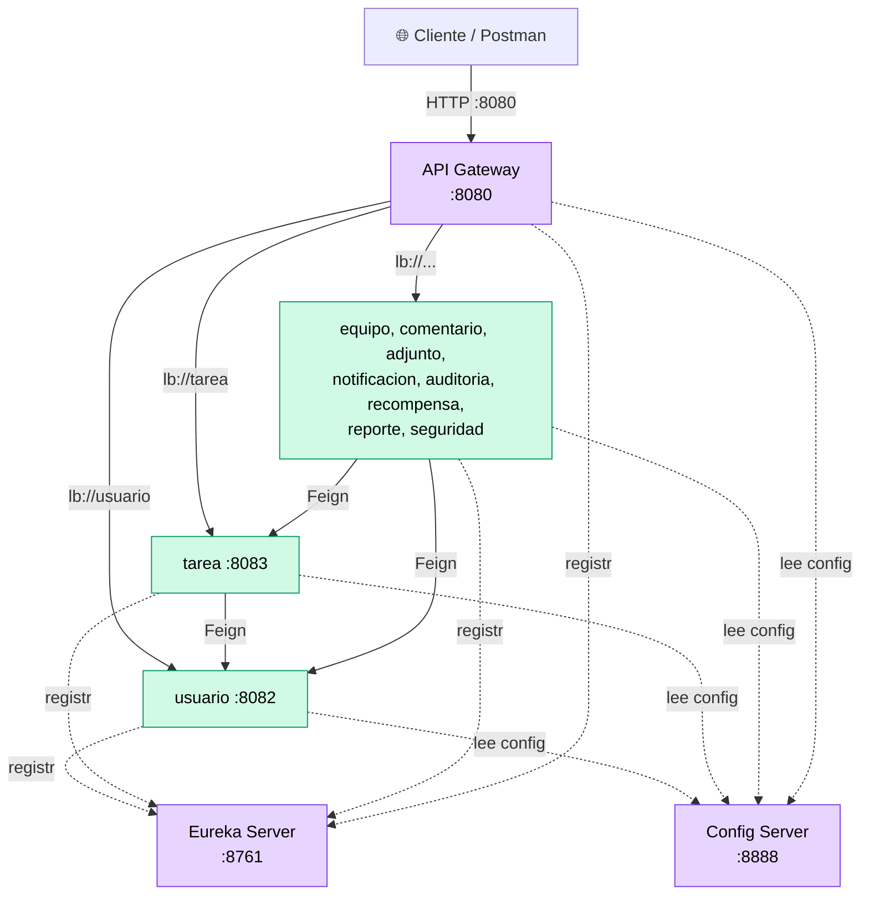
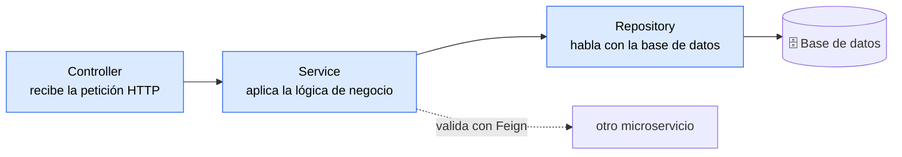
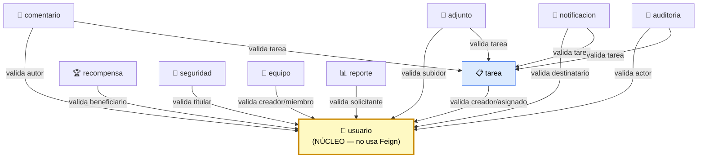
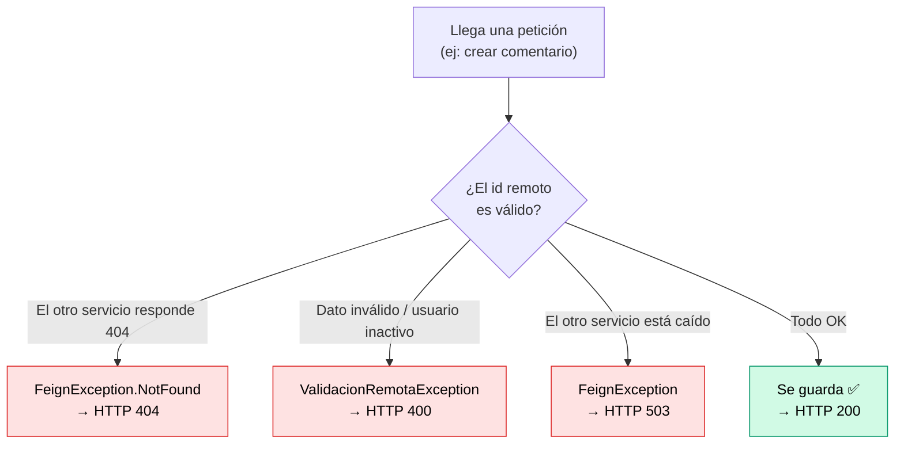
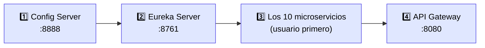
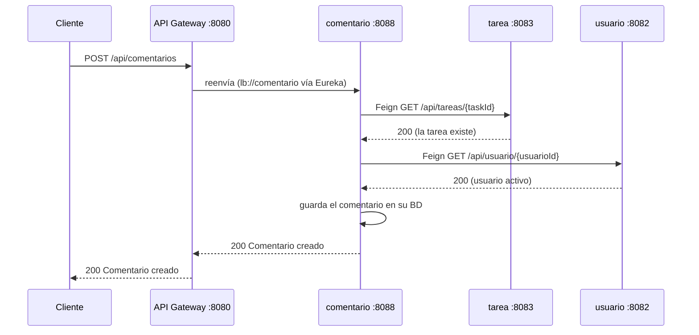

# 🎓 Guía de Defensa Técnica — TaskManager

> **Para qué sirve este documento:** prepararte para explicar, ejecutar y modificar el proyecto en la defensa individual (15 min). Está escrito desde cero, sin asumir que ya sabes microservicios. Cada sección termina con **"cómo lo digo en la defensa"**, y al final hay un **banco de preguntas y respuestas** mapeado a los indicadores de la rúbrica.
>
> **Regla de oro:** no se evalúa que el proyecto esté bonito, sino que **tú** lo entiendas. Si puedes explicar *por qué* se tomó cada decisión, ya tienes la mitad de la nota.

---

## 📑 Índice

1. [La idea en una frase](#1-la-idea-en-una-frase)
2. [Vocabulario mínimo](#2-vocabulario-mínimo)
3. [Arquitectura general](#3-arquitectura-general)
4. [Los 3 servicios de infraestructura](#4-los-3-servicios-de-infraestructura)
5. [El patrón CSR](#5-el-patrón-csr)
6. [Feign a fondo](#6-feign-a-fondo)
7. [Manejo de errores remotos](#7-manejo-de-errores-remotos)
8. [Orden de arranque](#8-orden-de-arranque)
9. [Cómo viaja una petición](#9-cómo-viaja-una-petición)
10. [Cheat-sheet de los 10 microservicios](#10-cheat-sheet-de-los-10-microservicios)
11. [Banco de preguntas y respuestas](#11-banco-de-preguntas-y-respuestas)
12. [Pendientes honestos](#12-pendientes-honestos)

---

## 1. La idea en una frase

**TaskManager** es un sistema de gestión de tareas y equipos, partido en **10 microservicios** independientes (usuarios, tareas, comentarios, adjuntos, etc.). Cada uno es una aplicación Spring Boot separada, con su **propia base de datos**, que se comunica con los demás por **HTTP/REST**.

Encima de esos 10 agregamos **3 piezas de infraestructura** que convierten 10 islas sueltas en un sistema ordenado:

- **Config Server** → la configuración central de todos.
- **Eureka Server** → la "guía telefónica" donde cada servicio se registra y se encuentra.
- **API Gateway** → la única puerta de entrada para el mundo exterior.

> **Cómo lo digo en la defensa:** *"TaskManager es una arquitectura de microservicios para gestión de tareas. Tiene 10 servicios de dominio, cada uno con su base de datos, y 3 de infraestructura: Config Server centraliza la configuración, Eureka permite que los servicios se descubran por nombre, y el API Gateway es la puerta única de entrada."*

---

## 2. Vocabulario mínimo

| Palabra | Qué significa en una frase |
|---|---|
| **Microservicio** | Una aplicación pequeña e independiente que resuelve **una sola** responsabilidad del negocio. |
| **REST** | Comunicación por HTTP usando rutas (`/api/...`) y verbos (GET, POST, PUT, DELETE, PATCH). |
| **Service Discovery** | Mecanismo por el que un servicio encuentra a otro **por su nombre**, sin saber su IP/puerto. Lo hace **Eureka**. |
| **Config centralizada** | Toda la configuración (puertos, bases de datos) vive en **un solo lugar** (Config Server). |
| **API Gateway** | Punto único de entrada que enruta cada petición al microservicio correcto. |
| **Feign** | Librería que permite llamar a otro microservicio escribiendo solo una **interfaz Java**, como si fuera un método local. |
| **DTO** (Data Transfer Object) | Objeto simple que solo **transporta datos** entre servicios (no es una entidad de base de datos). |
| **UUID** | El tipo de identificador que usa este proyecto: un código único largo (ej. `7c9e6679-...`) en vez de un número 1, 2, 3. |
| **Load Balancer (`lb://`)** | Reparte las peticiones entre instancias de un servicio. En el Gateway aparece como `lb://nombre-servicio`. |

> 💡 **Dato que te pueden preguntar:** en TaskManager los IDs son **UUID**, no números. Por eso los clientes Feign reciben y envían `UUID`.

---

## 3. Arquitectura general



**Cómo leer el diagrama:**
- **Flechas sólidas** = tráfico real de peticiones (el cliente entra por el Gateway; los servicios se llaman entre sí con Feign).
- **Flechas punteadas** = relación de infraestructura (registrarse en Eureka, leer config).
- Lo morado es **infraestructura**, lo verde es **dominio**.

> **Cómo lo digo:** *"El cliente nunca habla directo con un microservicio: siempre entra por el Gateway en el 8080. El Gateway pregunta a Eureka dónde está el servicio destino y reenvía la petición. Todos los servicios, al arrancar, leen su configuración del Config Server y se registran en Eureka."*

---

## 4. Los 3 servicios de infraestructura

Esta es la parte **nueva** que se agregó. La rúbrica la pesa fuerte (Gateway, YAML, despliegue).

### 4.1 Config Server (puerto 8888)

**Qué hace:** guarda la configuración de **todos** los servicios en un solo lugar. En vez de que cada microservicio tenga su puerto y su base de datos escritos adentro, los pide al Config Server cuando arranca.

**Cómo funciona aquí:**
- Usa perfil **`native`** → lee archivos `.yml` de una carpeta local: `config-server/src/main/resources/configurations/`.
- Hay un archivo por servicio: `usuario.yml`, `tarea.yml`, ... más `eureka-server.yml` y `api-gateway.yml`.
- Cada microservicio tiene un `application.yml` **mínimo** que solo dice su nombre y "pídele lo demás al Config Server":

```yaml
spring:
  application:
    name: tarea
  config:
    import: optional:configserver:http://localhost:8888
```

**Por qué es bueno:** si cambia la contraseña de la base de datos, la cambias en **un** archivo y no en diez.

> **Cómo lo digo:** *"El Config Server centraliza la configuración. Cada servicio solo trae su nombre y la dirección del Config Server; el puerto, la base de datos y Eureka los recibe al arrancar. Usé el perfil native, que lee los YAML de una carpeta local."*

### 4.2 Eureka Server (puerto 8761)

**Qué hace:** es la **guía telefónica** (registro de servicios). Cada microservicio, al arrancar, le dice a Eureka *"soy `usuario` y estoy en tal dirección"*. Así, cuando otro servicio quiere llamarlo, no necesita su IP: usa el **nombre** y Eureka le da la ubicación.

**Por qué importa:** sin Eureka tendrías que escribir IPs y puertos fijos en el código. Con Eureka la comunicación es **por nombre**, y si un servicio cambia de puerto no se rompe nada.

**Cómo verlo:** abre `http://localhost:8761` y verás el panel con todos los servicios registrados. *(Excelente para mostrar en vivo.)*

> **Cómo lo digo:** *"Eureka es el servidor de descubrimiento. Todos los servicios se registran ahí con su nombre lógico. Cuando uno necesita llamar a otro, lo busca por nombre en Eureka en lugar de usar una IP fija. Eso desacopla los servicios."*

### 4.3 API Gateway (puerto 8080)

**Qué hace:** es la **puerta única**. Todo cliente externo entra por el 8080. El Gateway mira la ruta de la petición y la reenvía al microservicio correcto.

**Cómo funciona aquí** (archivo `api-gateway.yml`): cada servicio tiene una **ruta** (`route`) con un **predicado** (`predicate`) que dice qué URL le corresponde:

```yaml
- id: usuario
  uri: lb://usuario              # lb = load balancer, resuelve por Eureka
  predicates:
    - Path=/api/usuario/**       # toda URL que empiece así va a este servicio
```

**Ejemplo:** el cliente pide `GET http://localhost:8080/api/usuario`. El Gateway ve el prefijo `/api/usuario/`, lo manda a `usuario`, que responde.

> ⚠️ **Ojo con un detalle que te pueden preguntar:** la ruta de *recompensa* es `/api/gamificacion`, pero el servicio se llama `recompensa`. El Gateway mapea `Path=/api/gamificacion/** → lb://recompensa`. La ruta de la URL y el nombre del servicio **no tienen que coincidir**.

> **Cómo lo digo:** *"El Gateway centraliza el enrutamiento. Cada ruta tiene un predicado de Path: según el prefijo de la URL, reenvía al microservicio correspondiente usando lb:// que resuelve el destino vía Eureka. El cliente solo conoce una dirección: el puerto 8080."*

---

## 5. El patrón CSR

Todos los microservicios siguen el patrón **CSR (Controller–Service–Repository/Model)**: separar responsabilidades en capas.



| Capa | Responsabilidad | Qué NO debe hacer |
|---|---|---|
| **Controller** | Recibe la petición, llama al service, devuelve la respuesta HTTP. | No debe tener lógica de negocio. |
| **Service** | Aquí vive la **lógica**: validaciones, reglas, llamadas Feign. | No debe tocar HTTP ni SQL directo. |
| **Repository** | Acceso a datos (extiende `JpaRepository`). | No debe tener reglas de negocio. |
| **Model / Entity** | La clase que representa una tabla (`@Entity`). | — |
| **DTO** | Objetos para transportar datos de entrada/salida. | — |

La dirección de dependencia siempre es Controller → Service → Repository. Nunca al revés.

> **Cómo lo digo:** *"Cada microservicio aplica CSR. El controller solo recibe y delega; toda la lógica y las validaciones están en el service; el repository solo accede a datos extendiendo JpaRepository."*

---

## 6. Feign a fondo

Esta es **la sección más importante** de la defensa. La rúbrica evalúa explícitamente la comunicación REST entre microservicios (indicadores IE 2.4.1 y IE 2.4.2), y acepta hacerla con **WebClient o Feign Client**. Nosotros usamos **Feign**.

### 6.1 ¿Qué es Feign y por qué lo usamos?

Feign es un **cliente HTTP declarativo**. En vez de escribir todo el código para armar una petición HTTP a otro servicio, solo declaras una **interfaz Java** con anotaciones, y Feign genera la implementación por debajo.

Llamar a otro microservicio queda tan simple como llamar a un método normal:

```java
UsuarioDTO u = usuarioClient.obtenerUsuario(id);   // ← esto dispara un GET HTTP real
```

### 6.2 ¿Por qué NO usamos URLs fijas?

Mira la diferencia:

```java
// ❌ Sin Eureka: la dirección está "quemada" en el código
@FeignClient(name = "usuario", url = "http://localhost:8082")

// ✅ Con Eureka (lo que hicimos): solo el NOMBRE; Eureka resuelve dónde está
@FeignClient(name = "usuario")
```

Con el nombre, si `usuario` cambia de puerto o se levantan varias instancias, **no tocas nada**: Eureka entrega la dirección actual y el load balancer reparte la carga. Esto es el corazón de una arquitectura de microservicios bien hecha.

### 6.3 El mapa de dependencias (quién llama a quién)



**Cómo se lee:**
- **usuario** (amarillo) es el **núcleo**: es la fuente de verdad de las personas. No llama a nadie → **es el único sin Feign**. Todos lo consultan.
- **tarea** (azul) es un **hub secundario**: además de validar usuarios, es validado por los servicios que referencian una tarea.

| Servicio | ¿Qué valida por Feign? | Clientes que tiene |
|---|---|---|
| usuario | nada (núcleo) | — |
| tarea | que el **creador** y el **asignado** existan y estén activos | UsuarioClient |
| equipo | que el **creador** y cada **miembro** existan | UsuarioClient |
| comentario | que la **tarea** exista + que el **autor** exista | UsuarioClient, TareaClient |
| adjunto | que la **tarea** exista + que el **subidor** exista | UsuarioClient, TareaClient |
| notificacion | que el **destinatario** exista + que la **tarea** exista (si viene) | UsuarioClient, TareaClient |
| auditoria | que el **actor** y la **tarea** existan (ambos opcionales) | UsuarioClient, TareaClient |
| recompensa | que el **beneficiario** exista | UsuarioClient |
| seguridad | que el **titular** del token/dispositivo exista | UsuarioClient |
| reporte | que el **solicitante** exista | UsuarioClient |

> 💡 **reporte tenía antes un `WebClient` sin usar.** Lo reemplazamos por Feign. Si te preguntan, este es un buen dato: *"el servicio de reporte tenía declarado un WebClient que no se usaba; lo migramos a Feign para unificar el estilo de comunicación"*.

### 6.4 Las 3 piezas de código de Feign

Para cada validación remota hay exactamente **tres piezas**. Te las debes saber:

**Pieza 1 — La interfaz Feign** (el "control remoto" del otro servicio):

```java
@FeignClient(name = "usuario")              // nombre que Eureka resuelve
public interface UsuarioClient {
    @GetMapping("/api/usuario/{id}")        // endpoint real del otro servicio
    UsuarioDTO obtenerUsuario(@PathVariable("id") UUID id);
}
```

**Pieza 2 — El DTO espejo** (una copia simple de los datos que me interesan):

```java
@Data
public class UsuarioDTO {
    private UUID id;
    private String nombre;
    private String email;
    private String rol;
    private Boolean activo;     // ← lo usamos para saber si el usuario está activo
}
```

**Pieza 3 — El uso en el service** (la validación antes de guardar):

```java
private void validarUsuario(UUID id, String etiqueta) {
    if (id == null) return;
    try {
        UsuarioDTO u = usuarioClient.obtenerUsuario(id);
        if (u == null || Boolean.FALSE.equals(u.getActivo())) {
            throw new ValidacionRemotaException("El usuario (" + etiqueta + ") no está activo");
        }
    } catch (FeignException.NotFound e) {
        throw new ValidacionRemotaException("El usuario (" + etiqueta + ") no existe");
    }
}
```

Y se llama al inicio del método de creación, por ejemplo en `tarea`:

```java
public Tarea crearTarea(TareaDTO dto) {
    validarUsuario(dto.getCreadorId(), "creador");   // ← Feign en acción
    validarUsuario(dto.getAsignadoId(), "asignado");
    // ... recién aquí se guarda la tarea
}
```

### 6.5 Qué hay que "activar" para que Feign funcione

Tres cosas, ni una más:

1. **La dependencia** en el `pom.xml`: `spring-cloud-starter-openfeign`.
2. **La anotación** `@EnableFeignClients` en la clase `…Application`.
3. **La anotación** `@EnableDiscoveryClient` (para que se registre en Eureka y pueda resolver nombres).

> **Cómo lo digo:** *"Usé Feign para la comunicación entre microservicios. Por ejemplo, antes de crear una tarea, el servicio valida con Feign que el creador exista y esté activo, llamando al servicio usuario. Feign es declarativo: defino una interfaz con @FeignClient(name=\"usuario\"), un DTO espejo, y lo uso en el service. El nombre lo resuelve Eureka, así que no hay URLs fijas."*

---

## 7. Manejo de errores remotos

La rúbrica no solo pide que los servicios se comuniquen, sino que **manejen bien los errores** de esa comunicación (IE 2.4.1). Para eso cada servicio con Feign tiene un **manejador global de errores** (`@RestControllerAdvice`) que traduce las fallas a códigos HTTP claros.



| Excepción | Código HTTP | Cuándo ocurre |
|---|---|---|
| `ValidacionRemotaException` | **400** Bad Request | El dato que mandó el cliente es inválido: el id no existe o el usuario está inactivo. |
| `FeignException.NotFound` | **404** Not Found | El microservicio remoto respondió 404 (el recurso no existe allá). |
| `FeignException` (genérica) | **503** Service Unavailable | El microservicio remoto no respondió (está caído o no registrado en Eureka). |

**Detalle técnico clave que te pueden preguntar:** para que esto funcione, los servicios destino (**usuario** y **tarea**) lanzan un **404 real** cuando no encuentran el recurso. Por eso `obtenerPorId` lanza una excepción anotada con `@ResponseStatus(HttpStatus.NOT_FOUND)`. Si lanzara un error genérico, el otro servicio recibiría un 500 y no podría distinguir "no existe" de "se cayó".

> **Cómo lo digo:** *"Cada servicio tiene un @RestControllerAdvice que traduce los errores de Feign: si el recurso remoto no existe devuelve 404, si el dato es inválido devuelve 400, y si el servicio remoto está caído devuelve 503. Además, usuario y tarea devuelven un 404 real cuando no encuentran algo, para que el llamador pueda distinguir los casos."*

---

## 8. Orden de arranque

El sistema **debe** levantarse en este orden. Si lo haces mal, los servicios no encuentran su config o no se registran.



**Por qué este orden:**

1. **Config Server primero** → los demás necesitan pedirle su configuración al arrancar.
2. **Eureka segundo** → los servicios necesitan un registro donde anotarse.
3. **Los microservicios** → arrancan, leen config y se registran. Conviene **usuario primero**, porque es el núcleo que todos validan.
4. **Gateway al final** → para enrutar necesita que los servicios ya estén registrados en Eureka.

> 💡 Si un servicio arranca antes que Eureka, no pasa nada grave: Spring reintenta el registro. Pero el orden recomendado evita errores y es lo que debes mostrar en la defensa.

> **Cómo lo digo:** *"El orden es Config Server, luego Eureka, luego los microservicios empezando por usuario, y al final el Gateway. La razón es de dependencias: cada uno necesita que el anterior esté disponible para configurarse y registrarse."*

---

## 9. Cómo viaja una petición

Ejemplo concreto para la defensa: **crear un comentario en una tarea**. Es el caso más completo porque toca el Gateway, Eureka y **dos** validaciones Feign.



**El relato paso a paso:**
1. El cliente hace `POST /api/comentarios` al **Gateway** (8080).
2. El Gateway ve el prefijo `/api/comentarios/` y reenvía a `comentario` (lo ubica por Eureka).
3. Antes de guardar, `comentario` **valida con Feign** que la tarea exista (llama a `tarea`).
4. Luego valida que el usuario autor exista y esté activo (llama a `usuario`).
5. Si ambas validaciones pasan, guarda el comentario en **su propia** base de datos.
6. La respuesta vuelve por el mismo camino hasta el cliente.

> **Cómo lo digo:** *"Cuando se crea un comentario, la petición entra por el Gateway, que la enruta al servicio comentario. Antes de guardar, comentario valida con Feign que la tarea y el usuario existan, llamando a los servicios tarea y usuario. Si todo está bien, guarda en su base de datos y responde. Cada servicio tiene su propia base, no comparten tablas."*

---

## 10. Cheat-sheet de los 10 microservicios

Tabla resumen para repasar de un vistazo:

| Servicio | Puerto | Base de datos | Ruta base | Consume (Feign) |
|---|---|---|---|---|
| usuario | 8082 | usuario_db | `/api/usuario` | — (núcleo) |
| tarea | 8083 | tareas_db | `/api/tareas` | usuario |
| notificacion | 8084 | notificaciones_db | `/api/notificaciones` | usuario, tarea |
| auditoria | 8085 | auditoria_db | `/api/auditoria` | usuario, tarea |
| recompensa | 8086 | gamificacion_db | `/api/gamificacion` | usuario |
| seguridad | 8087 | seguridad_db | `/api/seguridad` | usuario |
| comentario | 8088 | comentarios_db | `/api/comentarios` | usuario, tarea |
| adjunto | 8089 | adjuntos_db | `/api/adjuntos` | usuario, tarea |
| equipo | 8090 | equipos_db | `/api/equipos` | usuario |
| reporte | 8091 | reportes_db | `/api/reportes` | usuario |

### Detalle por servicio (dominio + endpoints reales)

**👤 usuario (8082)** — Núcleo: gestiona personas. Fuente de verdad de quién existe y quién está activo.
- `GET /api/usuario` — listar todos
- `GET /api/usuario/{id}` — obtener uno (devuelve 404 si no existe)
- `GET /api/usuario/email/{email}` — buscar por email
- `POST /api/usuario` — crear
- `PUT /api/usuario/{id}` — modificar
- `POST /api/usuario/login` — autenticar
- `DELETE /api/usuario/{id}` — desactivar (no borra, pone `activo=false`)

**📋 tarea (8083)** — Gestiona tareas. Valida que creador y asignado existan.
- `GET /api/tareas` — listar
- `GET /api/tareas/{id}` — obtener una (se agregó para que otros la validen por Feign)
- `GET /api/tareas/asignado/{asignadoId}` — tareas de un usuario
- `POST /api/tareas` — crear (valida creador y asignado vía Feign)
- `PATCH /api/tareas/{id}/estado` — cambiar estado

**🔔 notificacion (8084)** — Notificaciones a usuarios.
- `POST /api/notificaciones` — crear (valida usuario y tarea)
- `GET /api/notificaciones/usuario/{usuarioId}` — del usuario
- `GET /api/notificaciones/usuario/{usuarioId}/noleidas` — solo no leídas
- `PATCH /api/notificaciones/{id}/leer` — marcar leída

**📝 auditoria (8085)** — Registro de acciones del sistema.
- `POST /api/auditoria` — registrar acción (valida usuario y tarea si vienen)
- `GET /api/auditoria` — listar todo
- `GET /api/auditoria/usuario/{usuarioId}` — por usuario
- `GET /api/auditoria/tarea/{taskId}` — por tarea

**🏆 recompensa (8086)** — Gamificación: puntos a usuarios. (Ruta `/api/gamificacion`.)
- `POST /api/gamificacion/otorgar` — otorgar puntos (valida beneficiario)
- `GET /api/gamificacion/usuario/{usuarioId}/historial` — historial
- `GET /api/gamificacion/usuario/{usuarioId}/total` — puntos totales

**🔐 seguridad (8087)** — Tokens de refresco y dispositivos.
- `POST /api/seguridad/token/crear/{usuarioId}` — crear token (valida titular)
- `PATCH /api/seguridad/token/revocar` — revocar token
- `POST /api/seguridad/dispositivo` — registrar dispositivo (valida titular)
- `GET /api/seguridad/dispositivo/usuario/{usuarioId}` — dispositivos del usuario
- `DELETE /api/seguridad/dispositivo/{id}` — desactivar dispositivo

**💬 comentario (8088)** — Comentarios en tareas.
- `POST /api/comentarios` — crear (valida tarea y autor)
- `GET /api/comentarios/tarea/{taskId}` — comentarios de una tarea
- `PUT /api/comentarios/{id}` — editar
- `DELETE /api/comentarios/{id}` — eliminar

**📎 adjunto (8089)** — Archivos adjuntos a tareas.
- `POST /api/adjuntos` — registrar (valida tarea y subidor)
- `GET /api/adjuntos/tarea/{taskId}` — adjuntos de una tarea
- `DELETE /api/adjuntos/{id}` — eliminar

**👥 equipo (8090)** — Equipos y sus miembros.
- `POST /api/equipos` — crear (valida creador; lo agrega como LÍDER)
- `POST /api/equipos/{equipoId}/miembros` — agregar miembro (valida usuario)
- `GET /api/equipos/{equipoId}/miembros` — miembros del equipo
- `GET /api/equipos/usuario/{usuarioId}` — equipos de un usuario

**📊 reporte (8091)** — Generación de reportes.
- `POST /api/reportes/generar` — generar (valida solicitante)
- `GET /api/reportes` — historial completo
- `GET /api/reportes/{id}` — uno por id
- `GET /api/reportes/usuario/{solicitadoPor}` — reportes de un usuario

> 💡 **Truco de memoria:** los nombres de ruta no siempre son el plural del servicio. `tarea` → `/api/tareas`, `recompensa` → `/api/gamificacion`. Si te preguntan por qué, la respuesta es: *"el nombre de la ruta es independiente del nombre del servicio; lo importante es que el Gateway mapee el Path correcto al servicio correcto."*

---

## 11. Banco de preguntas y respuestas

Organizado por los **indicadores de evaluación (IE)** de la rúbrica. Practica respondiendo en voz alta.

### IE 1.2.1 — Estructura del proyecto (patrón CSR)

**P: ¿Cómo está estructurado cada microservicio?**
R: Con el patrón CSR por capas: `controller` recibe las peticiones HTTP, `service` tiene la lógica de negocio y las validaciones, `repository` accede a la base de datos extendiendo `JpaRepository`, y `model` son las entidades. También hay `dto` para transportar datos y `client` para los clientes Feign.

**P: ¿Por qué separar en capas?**
R: Para que cada parte tenga una sola responsabilidad. Si mañana cambio la base de datos, solo toco el repository. Si cambia una regla de negocio, solo el service. Es más fácil de mantener y probar.

### IE 2.2.1 — Reglas de negocio

**P: Dame un ejemplo de regla de negocio en tu proyecto.**
R: Al crear una tarea, el creador y el asignado **deben existir y estar activos**; eso se valida con Feign antes de guardar. Otro: al desactivar un usuario no se borra el registro, solo se pone `activo=false` (borrado lógico). Otro: al crear un equipo, el creador se agrega automáticamente como LÍDER.

**P: ¿Qué pasa si intento crear un comentario en una tarea que no existe?**
R: El servicio comentario valida la tarea con Feign, recibe un 404 del servicio tarea, y responde 400 Bad Request al cliente con un mensaje claro. El comentario **no** se guarda.

### IE 2.4.1 / 2.4.2 — Comunicación REST entre microservicios

**P: ¿Cómo se comunican tus microservicios?**
R: Por REST sobre HTTP, usando **Feign**. La rúbrica acepta WebClient o Feign; elegí Feign porque es declarativo: defino una interfaz y Feign genera la llamada. El destino se resuelve por nombre vía Eureka, sin URLs fijas.

**P: ¿Qué es un DTO y por qué no envías la entidad directamente?**
R: Un DTO es un objeto que solo transporta los datos que necesito. No expongo la entidad completa porque tiene campos internos (como el hash de la contraseña en usuario) que no deben viajar. El DTO espejo solo trae lo necesario para validar: id, nombre, email, rol, activo.

**P: ¿Qué pasa si el servicio remoto está caído?**
R: Feign lanza una `FeignException`, y mi `@RestControllerAdvice` la traduce a un 503 Service Unavailable. Si en cambio el recurso no existe, es un `FeignException.NotFound` que se traduce a 404.

**P: ¿Por qué los IDs son UUID y no números?**
R: Un UUID es un identificador único universal. La ventaja en microservicios es que cada servicio puede generar IDs sin coordinarse con los demás ni chocar. Por eso los clientes Feign usan `UUID`.

**P: ¿Por qué usuario no tiene Feign?**
R: Porque es el núcleo: es la fuente de verdad de las personas y no necesita preguntarle nada a nadie. Todos los demás lo consultan a él, no al revés.

### IE 3.3.x — Gateway, YAML, despliegue

**P: ¿Para qué sirve el API Gateway?**
R: Es la puerta única de entrada. El cliente solo conoce el puerto 8080; el Gateway enruta cada petición al microservicio correcto según el prefijo de la URL (predicado de Path), usando `lb://` que resuelve el destino por Eureka.

**P: ¿Qué es un predicado en el Gateway?**
R: Es la condición que decide a qué servicio va una petición. Usamos `Path`: por ejemplo `Path=/api/usuario/**` envía todo lo que empiece con esa ruta al servicio usuario.

**P: ¿Qué significa `lb://usuario`?**
R: `lb` es load balancer. En vez de una URL fija, le digo al Gateway "ve al servicio llamado usuario"; Eureka da la dirección y, si hay varias instancias, reparte la carga.

**P: ¿Por qué usas archivos YAML?**
R: Para configurar puertos, bases de datos, rutas del Gateway y el registro en Eureka de forma legible. Toda la config vive centralizada en el Config Server, en la carpeta `configurations`, con un YAML por servicio.

**P: ¿Qué es el perfil `native` del Config Server?**
R: Es el modo en que el Config Server lee los archivos de configuración desde una **carpeta local** (del classpath) en lugar de un repositorio Git remoto. Es lo más simple para un entorno local.

**P: ¿En qué orden levantas el sistema y por qué?**
R: Config Server, Eureka, los microservicios (usuario primero) y el Gateway al final. Por dependencias: cada uno necesita que el anterior esté disponible para configurarse y registrarse.

**P: (Si te piden modificar algo en vivo) ¿Cómo agregarías una ruta nueva al Gateway?**
R: En `api-gateway.yml`, agrego un bloque `route` con un `id`, el `uri: lb://nombre-servicio` y el `predicate` de Path. Como la config está en el Config Server, reinicio el Gateway y la toma.

> 💡 **Pregunta trampa frecuente:** *"¿El Gateway guarda datos?"* → **No.** El Gateway solo enruta; no tiene base de datos ni lógica de negocio. Lo mismo Eureka y Config Server: son infraestructura, no dominio.

---

## 12. Pendientes honestos

Sé transparente sobre qué está y qué no. Es mejor que **tú** lo digas a que el profe lo descubra.

### ✅ Lo que SÍ está implementado

- ✅ **10 microservicios** de dominio con patrón CSR.
- ✅ **Reglas de negocio** (validaciones, borrado lógico, roles).
- ✅ **Comunicación REST entre microservicios con Feign** + manejo de errores (400/404/503).
- ✅ **Config Server** (configuración centralizada, perfil native).
- ✅ **Eureka Server** (descubrimiento por nombre).
- ✅ **API Gateway** (enrutamiento con predicados de Path y `lb://`).
- ✅ **Archivos YAML** para toda la configuración.
- ✅ **Ejecución local** desde el IDE / `mvnw`.

### 🔲 Lo que FALTA (trabajo del equipo)

- 🔲 **Swagger / OpenAPI** — agregar `springdoc-openapi` y habilitar la UI (`/swagger-ui.html`). *La rúbrica lo pide (IE 3.2.1).*
- 🔲 **Pruebas unitarias** JUnit + Mockito con flujos Given-When-Then, cobertura objetivo 80%. *(IE 3.1.1)* — Por ahora solo existen los tests `contextLoads` por defecto; por eso se compila con `-DskipTests`.
- 🔲 **Despliegue** en Docker / Railway / Render. *(IE 3.3.1)*
- 🔲 **Git + Trello** — repositorio con historial de commits del equipo y tablero de tareas. *(IE 2.5.1 / 2.5.2)*

> ⚠️ **Advertencias de la rúbrica que NO debes olvidar:**
> - Un ítem **no implementado** se evalúa con **0** en ese indicador. Decide con tu equipo cuáles alcanzan a cubrir.
> - **No modifiques el repositorio después de la fecha de entrega**: la rúbrica indica que un cambio posterior puede significar **nota 1.0**.
> - La defensa es **individual**: la nota depende de lo que **tú** demuestres, no del grupo.

### ⏱️ Checklist de 60 segundos antes de defender

- [ ] MySQL corriendo en `localhost:3306`.
- [ ] Levanté en orden: Config (8888) → Eureka (8761) → microservicios → Gateway (8080).
- [ ] Abrí `http://localhost:8761` y veo los servicios registrados.
- [ ] Probé en Postman una creación que dispare Feign (ej: crear tarea con un creador válido).
- [ ] Probé el caso de error (crear con un id que no existe → debe dar 400).
- [ ] Sé explicar las 3 piezas de Feign (interfaz, DTO, uso en service).
- [ ] Sé el orden de arranque y por qué.
- [ ] Tengo claro qué está y qué no (sección 12).

---

### 🎯 Lo esencial en 4 frases

1. **TaskManager** son 10 microservicios de dominio + 3 de infraestructura (Config, Eureka, Gateway).
2. Cada servicio tiene su **propia base de datos** y patrón **CSR**.
3. Se comunican por **REST con Feign**, resolviendo destinos por **nombre vía Eureka**, con manejo de errores 400/404/503.
4. El **Gateway** es la puerta única; el **Config Server** centraliza la configuración; **usuario** es el núcleo que todos validan.

¡Mucho éxito en la defensa! 🚀

---

## 13. Swagger / OpenAPI — lo que se agregó y cómo explicarlo

### Qué se hizo

Se agregó `springdoc-openapi-starter-webmvc-ui 2.5.0` al `pom.xml` de los **10 servicios de dominio**, y `springdoc-openapi-starter-webflux-ui 2.5.0` al `api-gateway`. En cada servicio se creó una clase `OpenApiConfig` (en el paquete `config`) que define el título, versión y descripción de la API.

### Cómo acceder a Swagger en ejecución

| Servicio | URL |
|---|---|
| usuario | http://localhost:8082/swagger-ui.html |
| tarea | http://localhost:8083/swagger-ui.html |
| comentario | http://localhost:8088/swagger-ui.html |
| ... (resto) | http://localhost:**puerto**/swagger-ui.html |

También hay un endpoint de JSON para herramientas: `/api-docs`.

### Cómo explicarlo en la defensa

> *"Usé springdoc-openapi para generar automáticamente la documentación de la API de cada microservicio. Con solo agregar la dependencia y una clase de configuración, la biblioteca escanea los controladores y genera la UI de Swagger disponible en /swagger-ui.html. Ahí se pueden ver todos los endpoints, los DTOs de entrada/salida y probar las llamadas directamente desde el navegador."*

---

## 14. Pruebas unitarias JUnit 5 + Mockito

### Qué se hizo

Se crearon **pruebas unitarias con patrón Given-When-Then** para los dos servicios clave:

- **`UsuarioServiceTest`** — 8 tests sin Feign (el servicio núcleo). Cubre: listar, obtener por id (existe / no existe), crear (email nuevo / duplicado), desactivar (borrado lógico), login (correcto / contraseña mala / usuario inactivo).
- **`TareaServiceTest`** — 7 tests con Feign mockeado. Cubre: crear tarea (camino feliz), validación Feign con usuario no existente (404), usuario inactivo, servicio caído, cambiar estado a COMPLETADA (asigna fecha), tarea no encontrada, listar por asignado.

### Por qué estos tests (si te preguntan)

- **No levantan el contexto Spring** (`@ExtendWith(MockitoExtension.class)`) → corren en milisegundos, no necesitan base de datos.
- El **Feign Client se mockea** (`@Mock private UsuarioClient usuarioClient`) → permite simular un servicio remoto caído, un 404, o un usuario inactivo, sin levantar el servicio real.
- **`@InjectMocks`** crea el service e inyecta automáticamente los mocks declarados.
- Patrón **Given-When-Then** = legibilidad: separa datos de entrada, acción, y verificación.

### Cómo correrlos

```bash
cd usuario
./mvnw test          # corre solo las pruebas, sin levantar la app

cd tarea
./mvnw test
```

> **Cómo lo digo:** *"Los tests unitarios usan Mockito para aislar el servicio de sus dependencias. Por ejemplo, en TareaService mockeo el UsuarioClient para simular que el servicio de usuario devuelve un 404 y verifico que se lanza ValidacionRemotaException sin que se guarde la tarea. Con @ExtendWith(MockitoExtension.class) no necesito una base de datos real."*

---

## 15. Despliegue con Docker

### Qué se hizo

Se creó un `Dockerfile` **multi-etapa** para cada uno de los 13 servicios (10 de dominio + Config, Eureka, Gateway), y un `docker-compose.yml` en la raíz del proyecto que orquesta todo el sistema.

### Estructura del Dockerfile (multi-etapa)

```dockerfile
# Etapa 1: compilar (usa JDK)
FROM eclipse-temurin:17-jdk-alpine AS build
COPY mvnw pom.xml .mvn/ ./
RUN ./mvnw dependency:go-offline -DskipTests   # cache de deps
COPY src/ src/
RUN ./mvnw package -DskipTests

# Etapa 2: imagen final (solo JRE — mucho más liviana)
FROM eclipse-temurin:17-jre-alpine
COPY --from=build /workspace/target/*.jar app.jar
ENTRYPOINT ["java", "-jar", "app.jar"]
```

**Por qué multi-etapa:** la imagen final no trae el JDK ni el código fuente. El resultado es una imagen ~200 MB en vez de ~600 MB.

### Archivos creados

```
taskmanager2/
├── docker-compose.yml   ← orquesta los 13 servicios + MySQL
├── init-dbs.sql         ← crea las 10 bases de datos al arrancar MySQL
├── usuario/Dockerfile
├── tarea/Dockerfile
├── ...                  ← un Dockerfile por servicio
```

### Comandos de despliegue

```bash
# Desde la carpeta taskmanager2/
docker compose up --build   # construye imágenes y arranca todo

# Ver logs de un servicio específico
docker compose logs -f usuario

# Parar todo y borrar los volúmenes de datos
docker compose down -v
```

### Orden que maneja docker-compose

El `docker-compose.yml` define `depends_on` que replica el orden de arranque manual:

1. **mysql** — se espera hasta que el healthcheck (mysqladmin ping) pase.
2. **config-server** — espera a mysql; tiene su propio healthcheck.
3. **eureka-server** — espera a config-server.
4. **usuario** — arranca antes que todos los demás servicios de dominio.
5. **tarea, comentario, adjunto, notificacion, auditoria, recompensa, seguridad, equipo, reporte** — esperan a eureka + usuario.
6. **api-gateway** — espera a usuario y tarea (al menos).

### Variables de entorno clave

En Docker, las URLs `localhost` no funcionan entre contenedores. Por eso el compose sobreescribe con el **nombre del servicio Docker**:

| Variable | Valor local | Valor en Docker |
|---|---|---|
| datasource url | jdbc:mysql://`localhost`:3306/... | jdbc:mysql://`mysql`:3306/... |
| Eureka | http://`localhost`:8761/eureka/ | http://`eureka-server`:8761/eureka/ |
| Config Server | http://`localhost`:8888 | http://`config-server`:8888 |

> **Cómo lo digo:** *"Cada servicio tiene un Dockerfile multi-etapa: la primera etapa compila con JDK; la segunda solo copia el jar y usa JRE, lo que reduce el tamaño de imagen. El docker-compose.yml replica el orden de arranque del sistema usando depends_on con healthchecks. Las URLs de localhost se reemplazan por los nombres de los servicios Docker, que se resuelven por la red interna de Docker llamada tasknet."*

